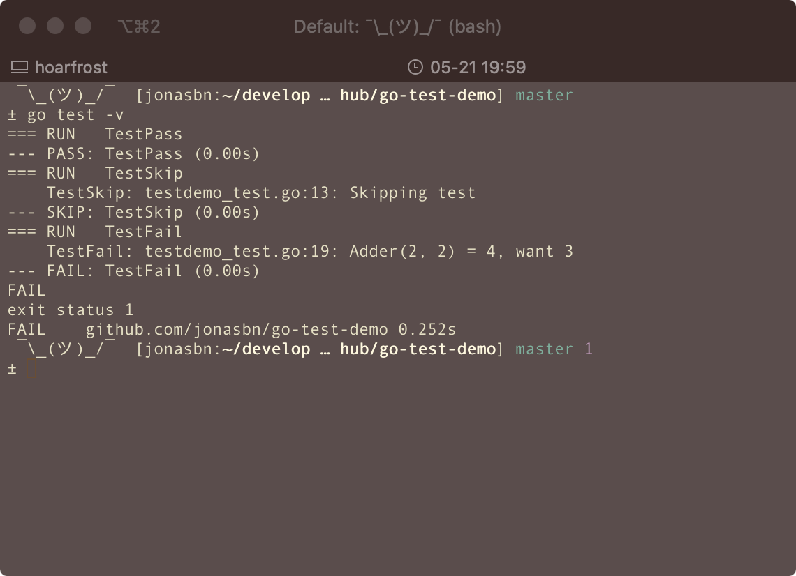
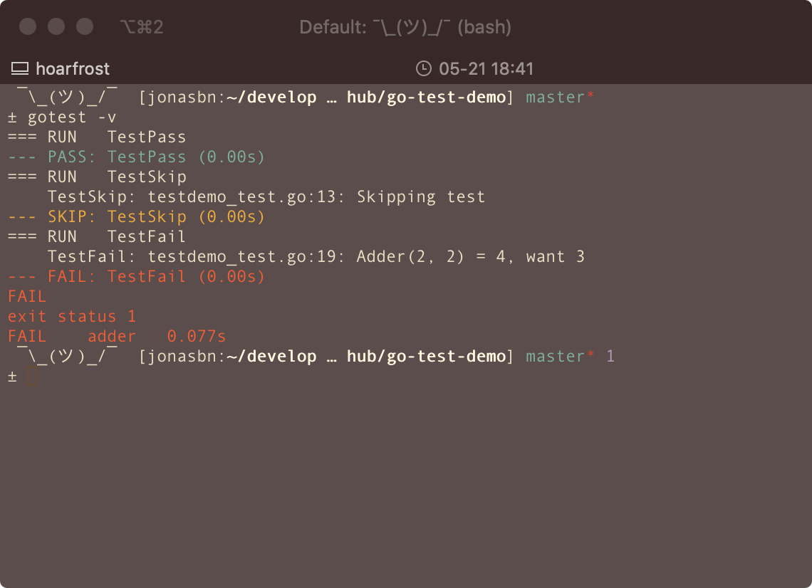

# go-test-demo

This is a basic repository I use for testing `gotest`, which provides colorful output, compared to the standard test tool.

Standard **go** toolchain:

```bash
$ go test -v
```



Using `gotest`

```
$ gotest -v
```



I use this repository for testing my contributions to `gotest`

## Resources and References

- [GitHub: rakyll/gotest](https://github.com/rakyll/gotest)
- [Go primary site](https://golang.org/doc/)
- [Go testing package](https://golang.org/pkg/testing/)
